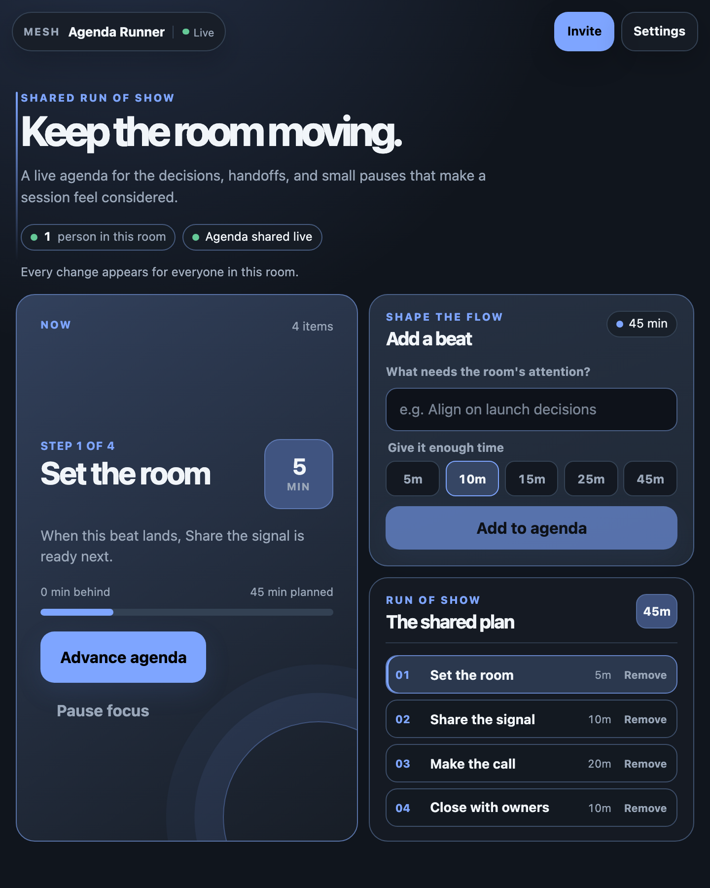
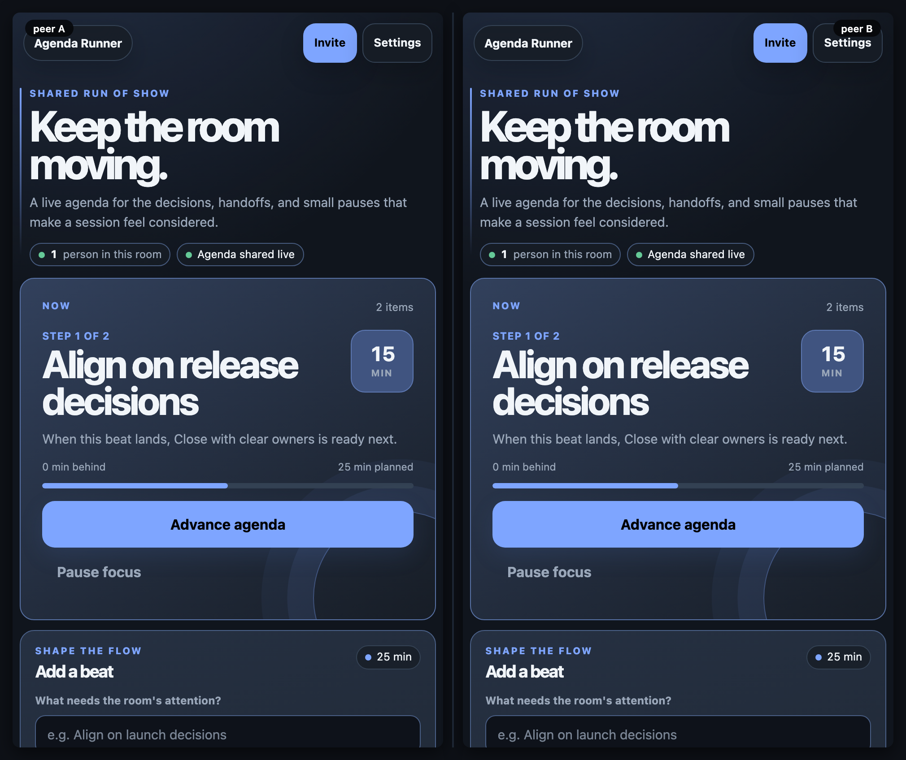
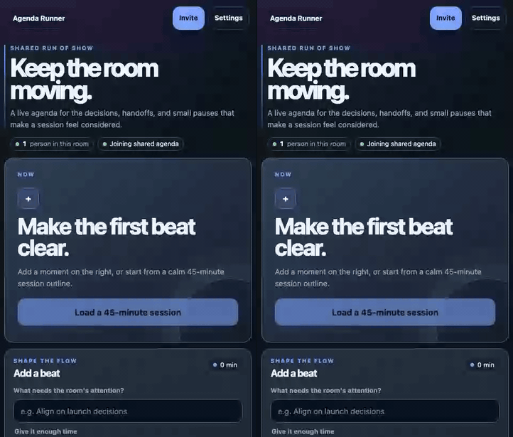

# Agenda Runner

[](https://baditaflorin.github.io/mesh-agenda-runner/)
[](https://github.com/baditaflorin/mesh-agenda-runner)

> A live, peer-to-peer run of show for the moments that make a session move.

**Live → [baditaflorin.github.io/mesh-agenda-runner](https://baditaflorin.github.io/mesh-agenda-runner/)**

Agenda Runner gives a room one shared plan and one shared **Now** state. Add a beat,
give it the time it deserves, choose it as the current focus, and everyone in the
same room sees the change immediately. There is no facilitator account or central
agenda service in the product path.



## A two-person session

1. Open the app on two devices and make sure both use the same room in Settings.
2. On either device, add a beat such as “Align on release decisions”.
3. On either device, select that beat or press **Start the agenda**.
4. Advance when the room is ready. The focus marker and agenda list converge over
   the shared Yjs room.



The short recording below is generated from a deterministic two-peer scenario:



## What is shared

- Agenda item title and allotted minutes
- The ordered run of show
- The currently focused item

Your room URL is the practical access boundary. Anyone who joins it can read,
add, select, or remove agenda items. Use a fresh room for a private session and
share the invite deliberately.

## Local development

`mesh-common` is a sibling package because this app consumes the shared primitives
directly.

```bash
git clone https://github.com/baditaflorin/mesh-common
git clone https://github.com/baditaflorin/mesh-agenda-runner
cd mesh-agenda-runner
npm ci --prefix ../mesh-common
npm ci
npm run dev
```

The repository’s deployment branch is `codex/initial-service` (not `main`), and
GitHub Pages serves its committed `docs/` directory. There are no GitHub Actions
workflows; Woodpecker is the server-side release gate.

## Verification

```bash
npm run fmt:check
npm run typecheck
npm run test:unit
npm run smoke
npm run test:e2e
MESH_LEAK_DURATION_MS=5000 MESH_LEAK_NOISE_OPS=20 npm run test:leak
npm run audit:security
npm audit --audit-level=high
```

To refresh the public assets after a visual change:

```bash
npm run screenshot
npm run demo
```

## Infrastructure and privacy

The app uses Mesh Common’s self-hosted WebRTC signaling and TURN infrastructure
for peer discovery and connectivity. Data is replicated between the browsers in a
room using Yjs; the app does not add an agenda database or product account layer.

Read the complete threat model in [docs/privacy.md](docs/privacy.md).

## License

MIT — see [LICENSE](LICENSE).
